<div align="center">

# ⚔️ Batalha Matemática RPG

### Plataforma educacional gamificada de matemática — Python · CustomTkinter · SQLite

*Transforme o estudo de matemática em uma jornada de RPG: **resolva, vença e evolua.***

[](https://www.python.org/)
[](https://github.com/TomSchimansky/CustomTkinter)
[](https://www.sqlite.org/)
[](LICENSE)
[]()

</div>

---

## 📖 Índice

1. [Visão Geral](#-visão-geral)
2. [Demonstração](#-demonstração)
3. [Sugestões de Imagens](#-sugestões-de-imagens-para-capturar)
4. [Fundamentação Matemática](#-fundamentação-matemática-projeto-integrador)
5. [Funcionalidades](#-funcionalidades)
6. [Modos de Jogo](#-modos-de-jogo)
7. [Modo RPG — Jornada do Herói](#️-modo-rpg--jornada-do-herói)
8. [Sistema de Conquistas](#-sistema-de-conquistas)
9. [Arquitetura do Software (MVC)](#️-arquitetura-do-software-padrão-mvc)
10. [Diagramas](#-diagramas)
11. [Tecnologias](#-tecnologias-utilizadas)
12. [Como Executar](#-como-baixar-e-executar)
13. [Estrutura do Projeto](#-estrutura-do-projeto)
14. [Licença](#️-licença)

---

## 🎯 Visão Geral

**Batalha Matemática** é uma plataforma educacional desktop que resolve o problema do **engajamento no aprendizado de matemática** transformando o estudo numa experiência interativa estilo RPG/eSports. Em vez de exercícios repetitivos, o aluno enfrenta inimigos, evolui de nível, desbloqueia conquistas e disputa rankings — tudo enquanto pratica aritmética, álgebra e raciocínio proporcional.

O diferencial técnico do projeto é que **nenhuma questão é fixa**: todas são geradas matematicamente em tempo real por um motor de análise combinatória, garantindo rejogabilidade infinita. Toda a lógica de jogo é fundamentada em conceitos matemáticos estruturais (lógica booleana, conjuntos, funções e combinatória), que estão **comentados diretamente no código-fonte**.

### Destaques

| Recurso | Descrição |
|---|---|
| 🎮 **9 modos de jogo** | Adição, Subtração, Tabuada, Frações, Porcentagem, Regra de Três, Equações, Desafio Rápido e Jornada RPG |
| 🗺️ **Modo RPG progressivo** | Fases infinitas com dificuldade gradual, chefes e dano crítico |
| 🏅 **25 conquistas** | 15 do modo clássico + 10 exclusivas do RPG |
| 👹 **58 inimigos únicos** | 48 inimigos comuns (28 no RPG + 20 no clássico) + 10 chefes, cada um com nome e visual próprios |
| 🆔 **Identidade por tag** | Cada jogador recebe uma tag única estilo `Heroi#4821` |
| 🏆 **3 rankings** | Global (XP), Modo RPG (fase máxima) e Por Modo (recorde) |
| 🔐 **Senhas criptografadas** | Hash SHA-256 para todas as senhas |

---

## 📸 Demonstração

> As imagens ficam na pasta **`docs/images/`**. Substitua os arquivos abaixo pelos seus prints reais (mantendo os mesmos nomes) e eles aparecerão automaticamente aqui.

### Telas principais

| Menu Principal (dashboard animado) | Seleção de Modos e Dificuldade |
|:--:|:--:|
| 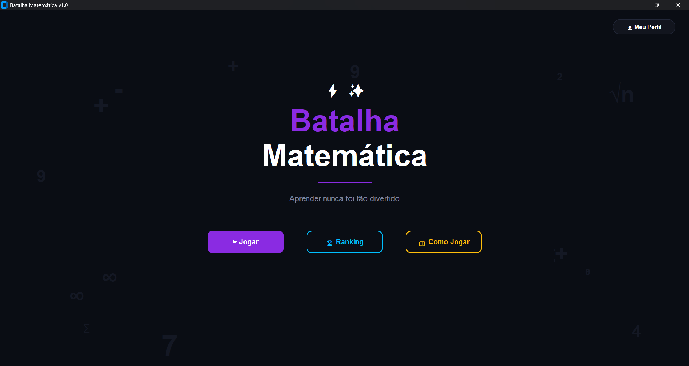 | 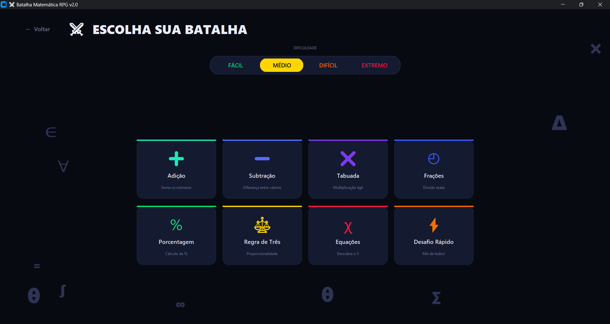 |

| Batalha — Modo Clássico (HUD) | Modo RPG — Jornada do Herói |
|:--:|:--:|
| 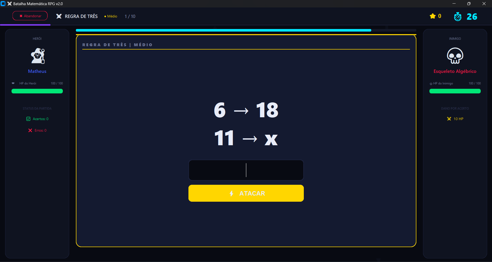 | 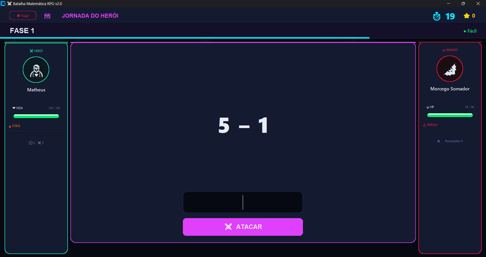 |

| Ranking Global | Perfil e Conquistas |
|:--:|:--:|
| 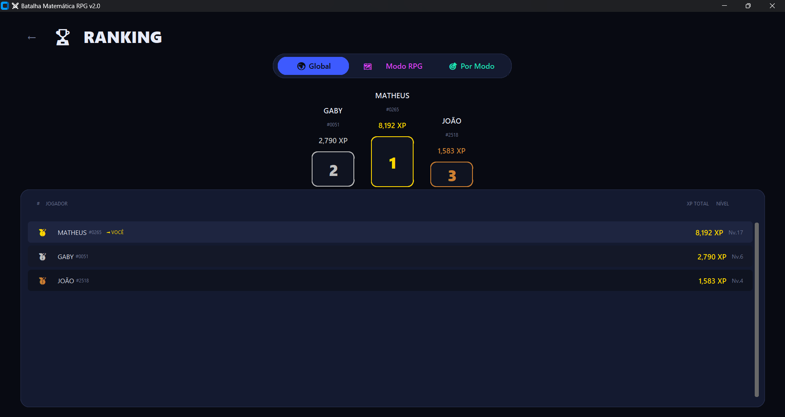 | 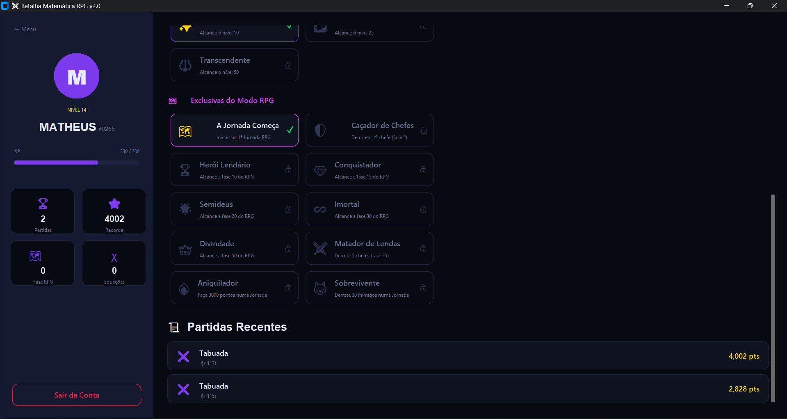 |

### Telas complementares

| Login / Cadastro | Tela de Resultados |
|:--:|:--:|
| 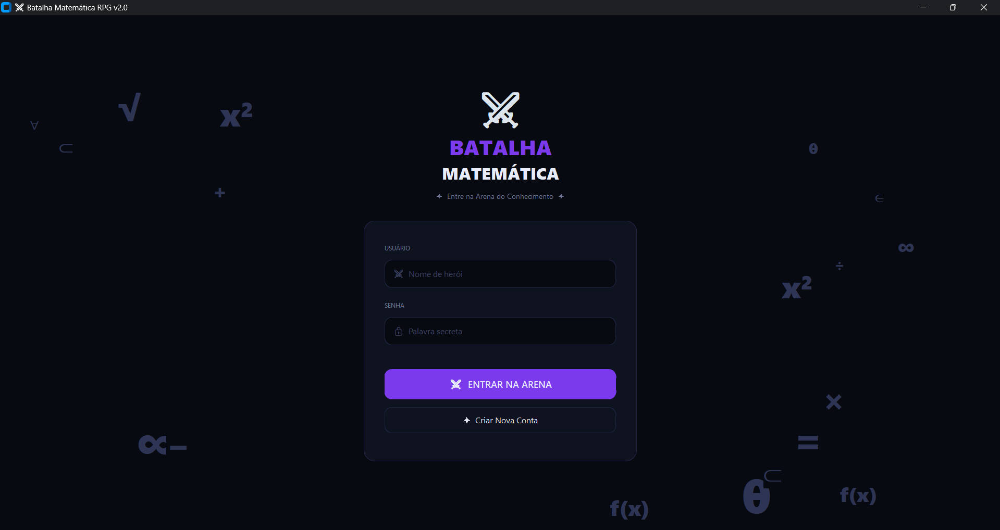 | 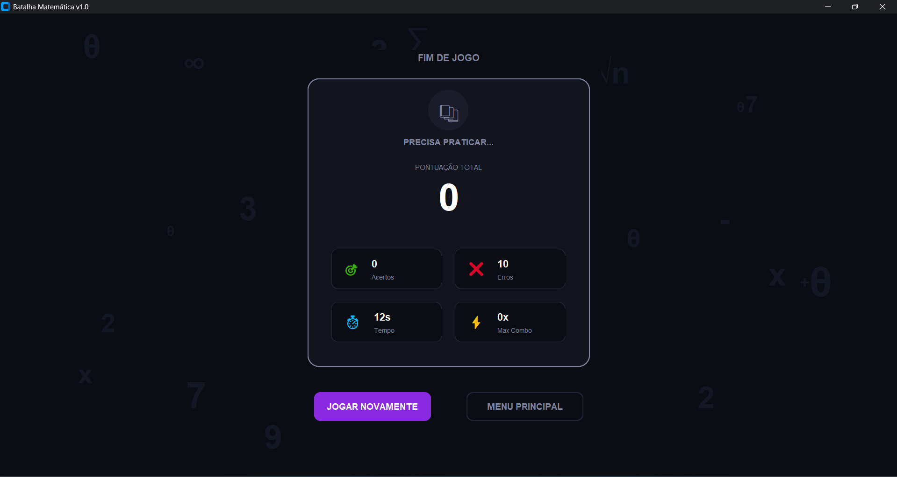 |

---

## 🎬 Sugestões de Imagens para Capturar

Para uma documentação completa e profissional, recomenda-se capturar as seguintes telas (use a tecla `PrtSc` ou a ferramenta de captura do sistema). Os nomes sugeridos correspondem aos arquivos já referenciados acima:

| Arquivo sugerido | O que capturar | Dica de captura |
|------------------|----------------|-----------------|
| `menu.png` | Menu principal com o dashboard do jogador | Logue com uma conta que já tenha XP/nível para o card de nível aparecer preenchido |
| `selecao_modo.png` | Grade dos 9 modos com o seletor de dificuldade | Deixe uma dificuldade selecionada (ex.: "Difícil") para mostrar o destaque |
| `gameplay.png` | Batalha de um modo clássico no meio da ação | Capture com um combo ativo e as barras de vida em cores diferentes (herói verde, inimigo amarelo) |
| `rpg.png` | Modo RPG, de preferência numa **fase de chefe** | A fase 5, 10 ou 15 mostra o chefe com moldura destacada e HP alto — visual mais impressionante |
| `rpg_critico.png` | Momento de **dano crítico** no RPG | Acerte 3 seguidas e capture o flash "GOLPE CRÍTICO" e a barra de Fúria cheia |
| `ranking.png` | Ranking com o pódio preenchido | Crie 3+ contas com pontuações diferentes para o pódio 🥇🥈🥉 ficar completo |
| `perfil.png` | Perfil com várias conquistas desbloqueadas | Jogue algumas partidas antes para ter conquistas ativas (coloridas) e bloqueadas (cinza) |
| `login.png` | Tela de login/cadastro | Tela limpa, mostrando o visual de entrada |
| `resultados.png` | Tela de fim de partida com o rank (👑/🌟/🔥) | Termine uma partida com boa pontuação para exibir um rank alto |
| `conquista_popup.png` *(opcional)* | Notificação de conquista desbloqueada | Capture no instante em que uma conquista nova aparece |
| `bestiario.png` *(opcional)* | Vários inimigos diferentes lado a lado | Monte uma colagem mostrando a variedade de sprites do RPG |

**Dicas gerais para prints de qualidade:**
- Use a janela em tamanho cheio e resolução consistente (ex.: 1100×720) para todas as capturas ficarem uniformes.
- Salve em **PNG** (melhor qualidade para interfaces, sem perda).
- Evite capturar dados pessoais reais; use contas de demonstração (ex.: `Heroi`, `Jogador1`).
- Para GIFs animados (mostrando o combate ou as animações do menu), ferramentas como **ScreenToGif** (Windows) ou **Peek** (Linux) funcionam bem — salve como `docs/images/demo.gif` e referencie com ``.

---

## 🧮 Fundamentação Matemática (Projeto Integrador)

Este projeto atende rigorosamente aos critérios da disciplina de **Matemática Computacional Aplicada**, aplicando o conceito **obrigatório de Lógica/Álgebra Booleana** em conjunto com outros três pilares matemáticos. Cada conceito não é apenas citado — ele é a **espinha dorsal** de um sistema do jogo, com a implementação comentada no código.

### 1) Lógica e Álgebra Booleana — *(conceito obrigatório)*

A lógica booleana é o motor de decisão do jogo inteiro. Toda a avaliação de respostas, controle de fluxo de combate e gatilhos de conquistas dependem de proposições que resultam em `True` ou `False`.

**Onde está aplicada:**

- **Validação de resposta** (`screens/game.py`, `screens/rpg.py`): a proposição `(resposta_usuario == resposta_correta)` decide todo o fluxo seguinte. Sendo verdadeira, aplica funções de bônus; sendo falsa, zera o combo e penaliza.
- **Detecção de chefe** (`controllers/rpg.py`): a proposição `(fase % 5 == 0)` determina se a fase atual é uma batalha de chefe.
- **Mecânica de dano crítico** (`controllers/rpg.py`): proposições sobre sequências consecutivas — `(acertos_seguidos >= 3)` libera o golpe crítico do herói; `(erros_seguidos >= 3)` aciona o contra-ataque crítico do inimigo.
- **Desbloqueio do Modo RPG** (`controllers/database.py`): o acesso é liberado pela proposição `(nivel >= 10)`.
- **Verificação de conquistas** (`controllers/conquistas.py`): cada uma das 25 conquistas é uma proposição booleana avaliada após cada partida (ex.: `total_partidas >= 100`).

> **Exemplo de tabela-verdade aplicada ao combate:**
>
> | `resposta_correta` | `combo_ativo` | Ação resultante |
> |:---:|:---:|:---|
> | V | V | Pontos + bônus de combo (multiplicador) |
> | V | F | Pontos base + inicia novo combo |
> | F | — | Zera combo, aplica dano ao herói |

### 2) Funções Matemáticas

O sistema de pontuação, progressão de nível e escalonamento do RPG são modelados como **funções matemáticas compostas**.

**Função de pontuação composta** (`controllers/pontuacao.py`):

```
f(base, tempo, combo, dif) = (base + g(tempo)) × h(combo) × k(dif)
```

onde:
- `g(tempo)` — bônus por velocidade (recompensa respostas rápidas);
- `h(combo) = 1.0 + (combo × 0.1)` — multiplicador progressivo (uma **Progressão Aritmética**: cada acerto consecutivo soma 0,1 ao multiplicador, então após 5 combos `h(5) = 1.5`, isto é, +50%);
- `k(dif)` — multiplicador de dificuldade (Fácil ×1.0, Médio ×1.5, Difícil ×2.0, Extremo ×3.0). Isto implementa o conceito de **Risk vs. Reward**: o modo Extremo vale 3× mais pontos que o Fácil.

**Função escada de nível** (`controllers/database.py`):

```
nivel(xp) = ⌊ xp / 500 ⌋ + 1
```

Uma função degrau (*step function*) que mapeia o XP acumulado para o nível do jogador — cada 500 de XP sobe um nível.

**Funções de progressão do RPG** (`controllers/rpg.py`) — o HP dos inimigos e o dano crescem linearmente com o número da fase:

```
HP_inimigo_comum(fase) = 30 + 8 × fase
HP_chefe(fase)         = 60 + 25 × fase
dano_no_heroi(fase)    = 8 + ⌊ fase / 3 ⌋
recompensa_XP(fase)    = 50 × fase × (3 se chefe, senão 1)
```

**Função por partes (dificuldade gradual)** — a dificuldade das questões no RPG é uma função definida por partes da fase:

```
            ⎧ Fácil    , se 1 ≤ fase ≤ 3
d(fase) =   ⎨ Médio    , se 4 ≤ fase ≤ 7
            ⎪ Difícil  , se 8 ≤ fase ≤ 12
            ⎩ Extremo  , se fase ≥ 13
```

### 3) Análise Combinatória

Em vez de um banco de perguntas estático e limitado, o módulo `GeradorMatematico` (`controllers/geradores.py`) atua como um **motor de análise combinatória**, criando um espaço amostral vasto de questões únicas.

**Espaço amostral por dificuldade** — os operandos são sorteados dentro de intervalos que crescem com a dificuldade, expandindo o número de combinações possíveis:

| Dificuldade | Intervalo dos operandos | Tamanho do espaço (tabuada) |
|---|---|---|
| Fácil | [1, 5] | 5² = 25 combinações |
| Médio | [2, 12] | 11² = 121 combinações |
| Difícil | [5, 25] | 21² = 441 combinações |
| Extremo | [15, 99] | 85² = 7.225 combinações |

Por exemplo, na tabuada o conjunto de questões é o **produto cartesiano** `A × A`, onde `A` é o intervalo de operandos — logo `|Ω| = (max − min + 1)²`.

**Geração de tags únicas** (`controllers/database.py`): cada jogador recebe uma tag de 4 dígitos (ex.: `Heroi#4821`). O espaço de tags é um **arranjo com repetição** de 10 dígitos em 4 posições:

```
|Ω| = 10⁴ = 10.000 combinações possíveis
```

A unicidade é garantida verificando a pertinência da tag candidata ao conjunto de tags já usadas.

### 4) Teoria dos Conjuntos

A Teoria dos Conjuntos garante experiências sem repetição e gerencia o estado de conquistas usando a estrutura `set()` do Python.

**Filtro anti-repetição** (`screens/game.py`): durante uma partida, cada nova questão gerada é testada quanto à **pertinência** (`equação not in perguntas_feitas`) ao conjunto de perguntas já exibidas. Isso impede que a mesma operação apareça duas vezes na mesma sessão, com verificação em tempo **O(1)** graças à tabela hash do `set`. Cada partida começa com o conjunto vazio (∅).

**Conjunto de conquistas** (`controllers/conquistas.py`): as conquistas de um jogador formam um conjunto. Ao terminar uma partida, calcula-se a **diferença de conjuntos** entre as conquistas recém-satisfeitas e as que o jogador já possuía, de modo que apenas as *novas* sejam notificadas (`novas = satisfeitas − já_obtidas`).

**Contagem de modos distintos** (`controllers/database.py`): a conquista "Explorador" usa a **cardinalidade** do conjunto de modos já jogados (`COUNT(DISTINCT modo)`), exigindo que o jogador tenha experimentado todos os 8 modos clássicos.

---

## 🎮 Funcionalidades

### Sistema de Contas
- Login e cadastro com senhas protegidas por criptografia **SHA-256** (função hash `h: Σ* → {0,1}²⁵⁶`).
- **Tag única** por jogador (estilo `Nome#1234`) que diferencia usuários de mesmo nome.
- Banco de dados relacional SQLite criado e migrado automaticamente na primeira execução.

### Gameplay
- **Geração procedural** de questões — nunca se repetem na mesma partida.
- **4 níveis de dificuldade** com multiplicadores de pontuação (Risk vs. Reward).
- **Sistema de combo** — acertos consecutivos geram bônus crescentes.
- **Bônus por tempo** — respostas rápidas valem mais pontos.
- **HUD de batalha** com barras de vida do herói e do inimigo, timer e efeitos visuais.

### Progressão e Perfil
- **XP e níveis** com barra de progresso (função escada de 500 XP por nível).
- **Dashboard de perfil** com estatísticas: total de partidas, recorde, fase máxima do RPG e precisão.
- **25 conquistas** desbloqueáveis, separadas entre clássicas e exclusivas do RPG.

### Rankings (3 categorias)
- 🌍 **Global** — por XP total acumulado.
- 🗺️ **Modo RPG** — por fase máxima alcançada na Jornada do Herói.
- 🎯 **Por Modo** — recordes de pontuação em cada modo específico.

---

## 🕹️ Modos de Jogo

| Modo | Ícone | Descrição | Conceito praticado |
|---|:---:|---|---|
| **Adição** | ➕ | Soma de 2 ou 3 parcelas conforme a dificuldade | Aritmética básica |
| **Subtração** | ➖ | Diferença entre valores (resultado sempre ≥ 0) | Aritmética básica |
| **Tabuada** | ✖️ | Multiplicação ágil | Produto cartesiano |
| **Frações** | ➗ | Divisão exata (resultado inteiro) | Divisibilidade |
| **Porcentagem** | % | Cálculo de percentuais | Função proporcional |
| **Regra de Três** | 📐 | Proporcionalidade direta | Proporção |
| **Equações** | 🟰 | Resolver `ax + b = c` | Álgebra linear |
| **Desafio Rápido** | ⚡ | Mistura de todos os modos | Raciocínio misto |
| **Jornada RPG** | 🗺️ | Modo campanha progressivo | Todos combinados |

Cada modo possui inimigos temáticos próprios, e o card de batalha adota a **cor característica do modo** selecionado.

---

## 🗺️ Modo RPG — Jornada do Herói

O modo principal do jogo, desbloqueado ao atingir o **nível 10**. Uma campanha de fases progressivas e **infinitas** que mistura todos os modos matemáticos.

### Mecânicas

- **Fases progressivas** com dificuldade gradual (função por partes): começa em Fácil e escala até Extremo.
- **Chefes a cada 5 fases** (5, 10, 15...) — inimigos com muito mais HP que concedem **XP triplo**. Há 10 chefes únicos que ciclam, do *Rei Goblin* 👑 ao *Imperador Dragão* 🐲.
- **Sistema de vida** — o herói tem 120 HP; cada erro causa dano, cada acerto fere o inimigo. Ao vencer uma fase, o herói recupera 15 HP.
- **Dano crítico (herói)** ⚡ — acertar **3 questões seguidas** libera um golpe que causa **dano dobrado**. A barra de Fúria mostra o progresso até o crítico.
- **Contra-ataque crítico (inimigo)** 💢 — errar **3 ou mais vezes seguidas** faz o inimigo desferir um golpe crítico cujo dano é **proporcional à dificuldade e ao tipo de inimigo**:

  ```
  dano_crítico = dano_base × fator(dificuldade) × (1.5 se chefe)
  ```

  Os fatores vão de ×1.5 (Fácil) a ×2.6 (Extremo) — e contra um chefe extremo o dano pode quase quadruplicar.

### Bestiário

| Categoria | Quantidade | Exemplos |
|---|:---:|---|
| Inimigos comuns | 28 (7 por dificuldade) | Slime 🟢, Goblin 👺, Orc 👹, Golem 🗿, Demônio 😈 |
| Chefes | 10 | Lich Supremo 💀, Devorador de Mundos 🛸, Fênix das Cinzas 🔥 |

---

## 🏅 Sistema de Conquistas

São **25 conquistas** ao todo, registradas individualmente por jogador no banco de dados. As do RPG são **exclusivas** — só podem ser obtidas jogando a Jornada do Herói.

### Conquistas Clássicas (15)

| Conquista | Requisito |
|---|---|
| 🌱 Pioneiro | Completar a 1ª partida |
| ⚔️ Veterano | Completar 10 partidas |
| 🔁 Incansável | Completar 50 partidas |
| 🎖️ Lenda Viva | Completar 100 partidas |
| 👑 Mestre | Pontuar mais de 500 numa partida |
| 💥 Imparável | Pontuar mais de 1000 numa partida |
| 💯 Perfeição | Acertar todas as 10 questões numa partida |
| 🎯 Perfeccionista | Fazer 10 partidas perfeitas |
| χ Algebrista | Jogar 5 partidas de Equações |
| 🧭 Explorador | Jogar todos os 8 modos clássicos |
| 🏹 Centurião | Acertar 100 questões no total |
| 📚 Sábio Milenar | Acertar 500 questões no total |
| ✨ Desperto | Alcançar o nível 10 |
| 🌠 Iluminado | Alcançar o nível 25 |
| 🔱 Transcendente | Alcançar o nível 50 |

### Conquistas Exclusivas do RPG (10)

| Conquista | Requisito |
|---|---|
| 🗺️ A Jornada Começa | Iniciar a 1ª Jornada RPG |
| 🛡️ Caçador de Chefes | Derrotar o 1º chefe (fase 5) |
| 🏆 Herói Lendário | Alcançar a fase 10 |
| 💎 Conquistador | Alcançar a fase 15 |
| 🌟 Semideus | Alcançar a fase 20 |
| ⚔️ Matador de Lendas | Derrotar 5 chefes (fase 25) |
| ♾️ Imortal | Alcançar a fase 30 |
| 👑 Divindade | Alcançar a fase 50 |
| 🔥 Aniquilador | Fazer 3000 pontos numa jornada |
| 🐺 Sobrevivente | Derrotar 30 inimigos numa jornada |

---

## 🏗️ Arquitetura do Software (Padrão MVC)

O projeto segue rigorosamente o padrão **MVC (Model-View-Controller)**, separando a interface gráfica das regras de negócio e da persistência de dados. Isso garante escalabilidade, testabilidade e manutenção facilitada.

### 🎨 View (`/screens`)
Camada de apresentação em CustomTkinter, totalmente desacoplada da lógica matemática.

| Arquivo | Responsabilidade |
|---|---|
| `tema.py` | Paleta de cores, fontes e helpers visuais |
| `login.py` | Tela de login e cadastro |
| `menu.py` | Menu principal (dashboard com cards animados) |
| `selecao_modo.py` | Grade de seleção de modos e dificuldade |
| `game.py` | Batalha dos modos clássicos |
| `rpg.py` | Tela da Jornada do Herói |
| `resultados.py` | Tela de fim de partida com ranqueamento |
| `ranking.py` | Leaderboard com 3 categorias |
| `perfil.py` | Perfil, estatísticas e conquistas |
| `como_jogar.py` | Manual de regras |

### ⚙️ Controller (`/controllers`)
Motores de processamento — a ponte entre interface e dados.

| Arquivo | Responsabilidade | Matemática |
|---|---|---|
| `geradores.py` | Geração procedural de questões | Análise Combinatória |
| `pontuacao.py` | Cálculo de pontos, combos e multiplicadores | Funções compostas |
| `rpg.py` | Motor de fases, chefes e dano crítico | Funções de progressão, Lógica |
| `conquistas.py` | Catálogo e verificação de conquistas | Teoria dos Conjuntos, Lógica |

### 🗄️ Model (`/database`)
Camada de persistência em SQLite, encapsulada em `database.py`, responsável por transações seguras, criptografia de senhas e migração automática de esquema.

**Esquema do banco:**
- `usuarios` — id, username, tag, senha (hash), xp_total, nivel, rpg_fase_max, data_criacao
- `partidas` — id, usuario_id, modo, pontos, acertos, tempo, fase_rpg, data
- `conquistas` — id, usuario_id, chave, data *(com restrição UNIQUE por jogador)*

---

## 📊 Diagramas

### Fluxo do Motor de Jogo (Gameplay Loop)

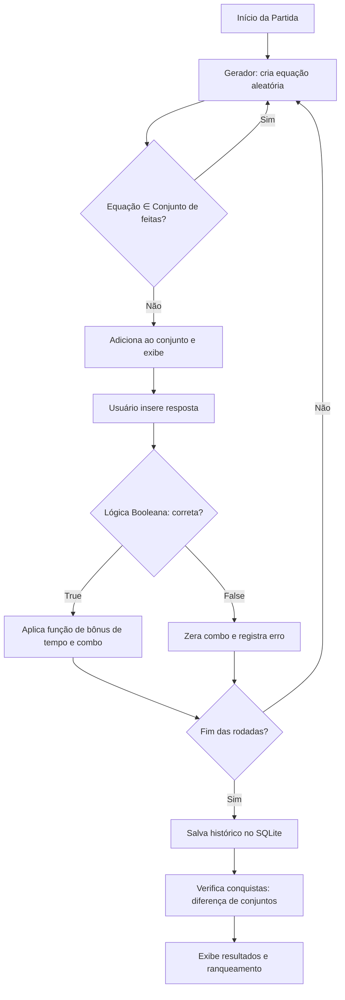

### Fluxo de Combate do Modo RPG (com Dano Crítico)

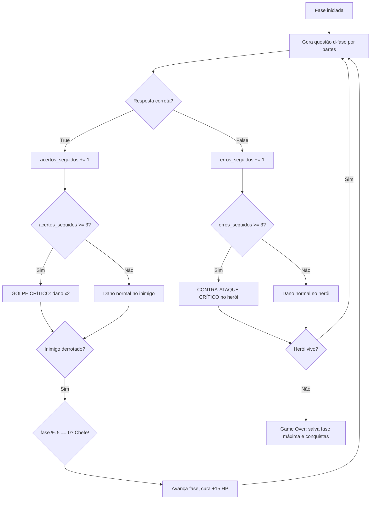

### Arquitetura MVC

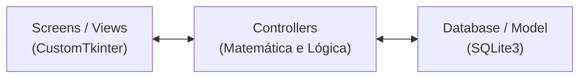

---

## 💻 Tecnologias Utilizadas

| Tecnologia | Uso |
|---|---|
| **Python 3.10+** | Linguagem principal |
| **CustomTkinter 5.2+** | Interface gráfica moderna (tema dark) |
| **SQLite3** | Banco de dados relacional embutido |
| **Hashlib** | Criptografia de senhas (SHA-256) |

---

## 🚀 Como Baixar e Executar

### Pré-requisitos
- Python 3.10 ou superior instalado.

### Passo a passo

**1.** Clone o repositório:
```bash
git clone https://github.com/SEU-USUARIO/BatalhaMatematica.git
cd BatalhaMatematica
```

**2.** *(Recomendado)* Crie e ative um ambiente virtual:
```bash
python -m venv venv

# Windows
venv\Scripts\activate

# Linux/Mac
source venv/bin/activate
```

**3.** Instale as dependências:
```bash
pip install -r requirements.txt
```

**4.** Execute a aplicação:
```bash
python main.py
```

> 💡 O banco `batalha_matematica.db` é criado automaticamente na pasta `database/` na primeira execução. Não é necessária nenhuma configuração adicional.

---

## 📁 Estrutura do Projeto

```text
BatalhaMatematica/
│
├── main.py                      # Ponto de entrada (roteador de telas)
├── requirements.txt             # Dependências
├── README.md                    # Esta documentação
├── LICENSE                      # Termos de uso (CC BY-NC 4.0)
├── .gitignore                   # Arquivos ignorados pelo Git
│
├── docs/                        # 📸 Documentação e mídia
│   └── imagem/                  # Prints e GIFs do projeto (usados no README)
│       ├── menu.png
│       ├── selecao_modo.png
│       ├── gameplay.png
│       ├── rpg.png
│       ├── ranking.png
│       ├── perfil.png
│       ├── login.png
│       └── resultados.png
│
├── screens/                     # 🎨 VIEW (Interface CustomTkinter)
│   ├── tema.py                  # Paleta, fontes e helpers visuais
│   ├── login.py                 # Login e cadastro
│   ├── menu.py                  # Menu principal (dashboard animado)
│   ├── selecao_modo.py          # Seleção de modo e dificuldade
│   ├── game.py                  # Batalha dos modos clássicos
│   ├── rpg.py                   # Jornada do Herói (Modo RPG)
│   ├── resultados.py            # Tela de resultados
│   ├── ranking.py               # Leaderboard (3 categorias)
│   ├── perfil.py                # Perfil e conquistas
│   └── como_jogar.py            # Manual de regras
│
├── controllers/                 # ⚙️ CONTROLLER (Regras de negócio)
│   ├── geradores.py             # Análise combinatória (questões)
│   ├── pontuacao.py             # Funções de pontuação e combo
│   ├── rpg.py                   # Motor de fases, chefes e críticos
│   └── conquistas.py            # Sistema de conquistas (conjuntos)
│
└── database/                    # 🗄️ MODEL (Persistência)
    ├── database.py              # Conexão, queries e criptografia
    └── batalha_matematica.db    # Gerado automaticamente
```

---

## ⚖️ Licença

Este projeto está licenciado sob a **Creative Commons Attribution-NonCommercial 4.0 International (CC BY-NC 4.0)**.

Você é livre para **compartilhar** e **adaptar** este código para fins educacionais e não comerciais, desde que atribua os devidos créditos. O **uso comercial é proibido**.

Para detalhes, veja o arquivo [LICENSE](LICENSE) ou o [resumo da licença](https://creativecommons.org/licenses/by-nc/4.0/).

---

<div align="center">

*Projeto Integrador desenvolvido para a disciplina de **Matemática Computacional Aplicada** (2026/1).*

**⭐ Resolva. Vença. Evolua. ⭐**

</div>
