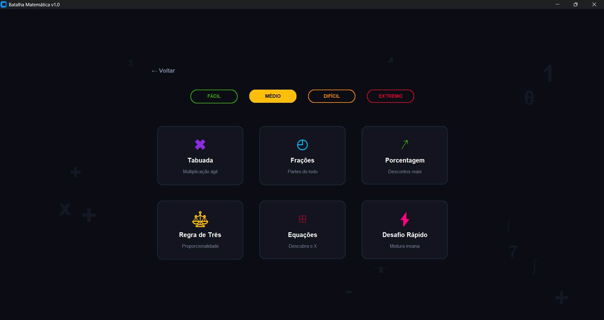
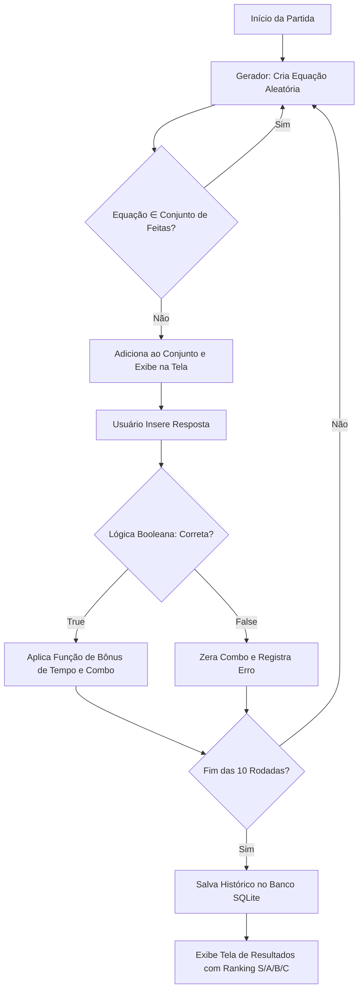
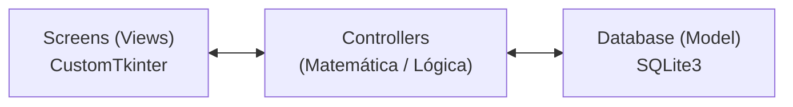

# ⚡ Batalha Matemática (Python + CustomTkinter + SQLite)

Plataforma educacional desktop gamificada construída com **Python**, **CustomTkinter** e **SQLite**.  
O objetivo do projeto é resolver o problema do engajamento no aprendizado de matemática básica e avançada, transformando o estudo em uma experiência interativa (estilo eSports) com foco em:

- **Gamificação:** Sistema de XP, Níveis, Combos e Ranks (👑, 🌟, 🔥).
- **Geração Procedural:** Questões geradas matematicamente em tempo real (sem banco de perguntas estático).
- **Persistência de Dados (SQLite):** Histórico de partidas e Ranking Global.
- **Arquitetura MVC:** Separação limpa entre Interface (View), Regras (Controller) e Dados (Model).

Repositório: https://github.com/SEU-USUARIO/BatalhaMatematica

---

## 📸 Demonstração (Telas)

> As imagens ficam em `docs/images/` (adicione suas prints aqui futuramente).

### Menu Principal (Dark UI Premium)


### Seleção de Modos e Dificuldade


### Gameplay (HUD de Batalha)


### Resultados e Ranqueamento


---

## 🧮 Fundamentação Matemática (Projeto Integrador)

Este projeto foi construído utilizando conceitos matemáticos estruturais para resolver problemas computacionais de forma otimizada, atendendo rigorosamente aos critérios da disciplina de Matemática Computacional Aplicada.

### 1) Lógica e Álgebra Booleana (Controle de Fluxo)
Utilizada exaustivamente no motor do jogo e na lógica de pontuação. As validações de resposta do usuário, cálculo de bônus por tempo e manipulação de multiplicadores de combo dependem da avaliação de proposições lógicas (`True/False`). 
* **Exemplo prático:** O sistema avalia a proposição `(resposta_usuario == resposta_correta)`. Sendo verdadeira, aciona funções matemáticas de acréscimo de pontos; sendo falsa, zera a variável de combo e penaliza o jogador.

### 2) Análise Combinatória (Geração Dinâmica)
Em vez de utilizar um banco de dados estático e limitante, o módulo `GeradorMatematico` atua como um motor de Análise Combinatória. 
* **Exemplo prático:** O algoritmo utiliza permutações aleatórias dentro de intervalos limitados pelas dificuldades (Fácil, Médio, Difícil, Extremo) para criar um **espaço amostral vasto** de equações matemáticas únicas a cada rodada.

### 3) Teoria dos Conjuntos (Filtro Anti-Repetição)
Para garantir uma experiência de usuário impecável, foi aplicada a Teoria dos Conjuntos na memória temporária da partida por meio da estrutura `set()`. 
* **Exemplo prático:** O sistema avalia a pertinência (operador lógico `not in`) de cada nova equação gerada em relação ao conjunto de perguntas já exibidas. Isso impede que a mesma operação matemática seja sorteada duas vezes na mesma sessão, com complexidade de tempo $O(1)$.

---

## 🎮 Funcionalidades

### Sistema de Contas
- Login e Cadastro protegidos com criptografia de senhas (**SHA-256**).
- Banco de dados relacional isolado criando instâncias automaticamente.

### Gameplay e Modos
- **Modos de Jogo:** Tabuada, Frações, Porcentagem, Regra de Três, Equações e Desafio Rápido.
- **Risk vs. Reward (Risco e Recompensa):** Multiplicadores de pontos dinâmicos. Jogar no modo "Extremo" concede 3x mais pontos do que no "Fácil".
- **Tempo e Combo:** Respostas rápidas e acertos consecutivos geram bônus exponenciais na pontuação final.

### Dashboard de Perfil e Conquistas
- Exibição de Nível do Jogador, Barra de Progresso de XP e Taxa de Precisão.
- Sistema de medalhas desbloqueáveis (Pioneiro, Veterano, Mestre).

### Ranking Global
- Leaderboard que consome dados via SQL listando os melhores jogadores do servidor por XP total e recordes em modos específicos.

---

## 🏗️ Arquitetura do Software (Padrão MVC)

O projeto foi estruturado seguindo o padrão de projeto **MVC (Model-View-Controller)** para garantir escalabilidade e fácil manutenção:

1. **Views (`/screens`):** Camada de apresentação gráfica desenvolvida em `CustomTkinter`. Totalmente desacoplada da lógica matemática.
2. **Controllers (`/controllers`):** Motores de processamento. Incluem a geração combinatória (`geradores.py`) e regras de gamificação (`pontuacao.py`). Atuam como ponte entre a interface e os dados.
3. **Models (`/database`):** Camada de persistência em SQLite, encapsulada pelo `database.py`, responsável pelas transações seguras e execução de queries SQL.

---

## 📊 Diagramas

### Fluxo do Motor de Jogo (Gameplay Loop)



### Arquitetura MVC



---

## 💻 Tecnologias Utilizadas

- **Python 3.x**
- **CustomTkinter** (Interface Gráfica Premium Moderna)
- **SQLite3** (Banco de Dados embutido)
- **Hashlib** (Criptografia)

---

## 🚀 Como Baixar e Executar

### Pré-requisitos
- Python 3.10 ou superior instalado.

### Passo a Passo
1. Clone o repositório:
```bash
git clone [https://github.com/SEU-USUARIO/BatalhaMatematica.git](https://github.com/SEU-USUARIO/BatalhaMatematica.git)
cd BatalhaMatematica
```

2. (Recomendado) Crie e ative um ambiente virtual:
```bash
python -m venv venv
# No Windows:
venv\Scripts\activate
# No Linux/Mac:
source venv/bin/activate
```

3. Instale as dependências:
```bash
pip install -r requirements.txt
```

4. Execute a aplicação:
```bash
python main.py
```
*(O banco de dados `batalha_matematica.db` será criado automaticamente na pasta `database/` na primeira execução).*

---

## 📁 Estrutura do Projeto

```text
BatalhaMatematica/
│
├── main.py                 # Ponto de entrada da aplicação
├── requirements.txt        # Dependências do projeto
├── README.md               # Documentação principal
├── LICENSE                 # Termos de uso e distribuição
│
├── screens/                # Camada VIEW (Interface)
│   ├── login.py
│   ├── menu.py
│   ├── game.py
│   └── ...
│
├── controllers/            # Camada CONTROLLER (Regras de Negócio)
│   ├── geradores.py        # Análise combinatória
│   └── pontuacao.py        # Matemática de pontuação
│
└── database/               # Camada MODEL (Dados)
    ├── database.py         # Conexão e queries SQLite
    └── batalha_matematica.db # Gerado automaticamente
```

---

## ⚖️ Licença

Este projeto está licenciado sob a licença **Creative Commons Attribution-NonCommercial 4.0 International (CC BY-NC 4.0)**. 

Você é livre para compartilhar e adaptar este código para fins educacionais e não comerciais, desde que atribua os devidos créditos. O uso comercial é terminantemente proibido.

Para mais detalhes, veja o arquivo [LICENSE](LICENSE) ou acesse o [Resumo da Licença](https://creativecommons.org/licenses/by-nc/4.0/).

---
*Projeto Integrador desenvolvido por Matheus para a disciplina de Matemática Computacional Aplicada (2026/1).*